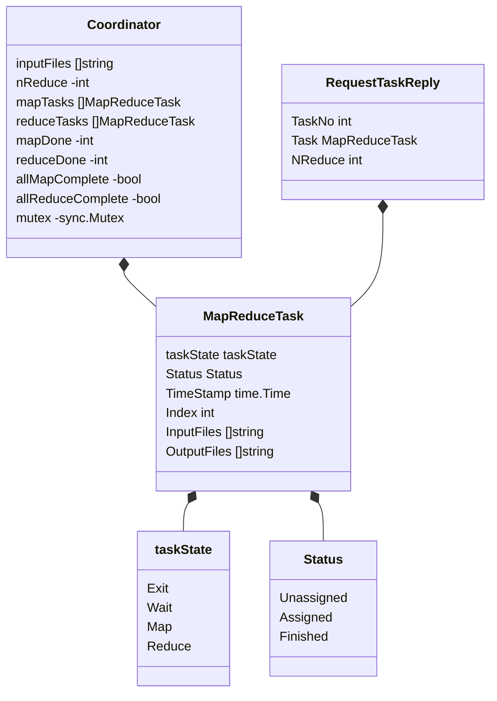
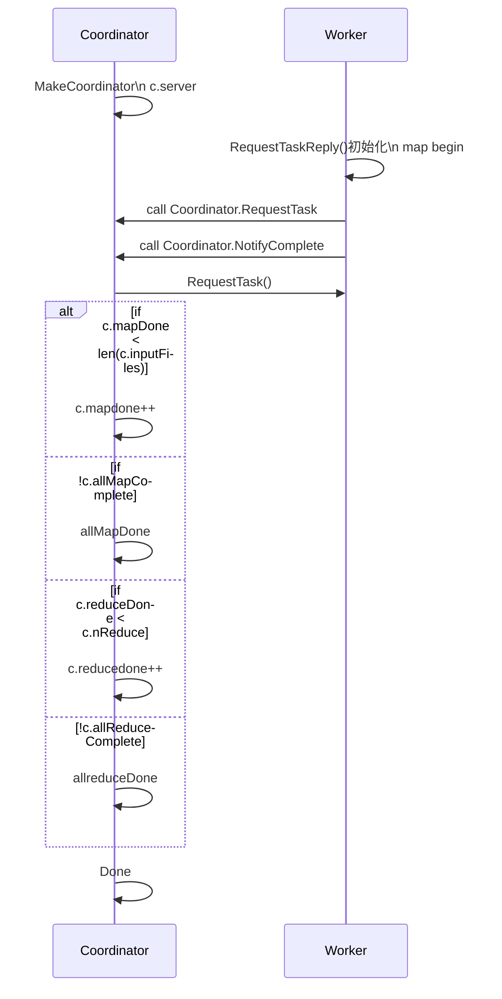

# constractor

```mermaid
classDiagram
class Coordinator{
inputFiles []string
	nReduce    -int

	mapTasks    []MapReduceTask
	reduceTasks []MapReduceTask

	mapDone    -int
	reduceDone -int

	allMapComplete    -bool
	allReduceComplete -bool

	mutex -sync.Mutex
}
class MapReduceTask{
  taskState      taskState
	Status    Status
	TimeStamp time.Time
	Index     int

	InputFiles  []string
	OutputFiles []string
}
class taskState{
  Exit 
	Wait
	Map
	Reduce
}
class Status{
  Unassigned 
	Assigned
	Finished
}
class RequestTaskReply{
  TaskNo  int
	Task    MapReduceTask
	NReduce int
}
Coordinator *-- MapReduceTask
MapReduceTask *-- taskState
MapReduceTask *-- Status
RequestTaskReply *-- MapReduceTask
```

## uml: state diagram

```mermaid
sequenceDiagram
Coordinator ->> Coordinator: MakeCoordinator\n c.server
Worker ->> Worker: RequestTaskReply()初始化\n map begin

Worker ->> Coordinator: call Coordinator.RequestTask
Worker ->> Coordinator: call Coordinator.NotifyComplete
Coordinator ->> Worker: RequestTask()
alt if c.mapDone < len(c.inputFiles)
 
    Coordinator ->> Coordinator : c.mapdone++
else if !c.allMapComplete
    Coordinator ->> Coordinator: allMapDone
else if c.reduceDone < c.nReduce
    Coordinator ->> Coordinator:c.reducedone++
else !c.allReduceComplete
    Coordinator ->> Coordinator:allreduceDone
end
 Coordinator ->> Coordinator: Done
```